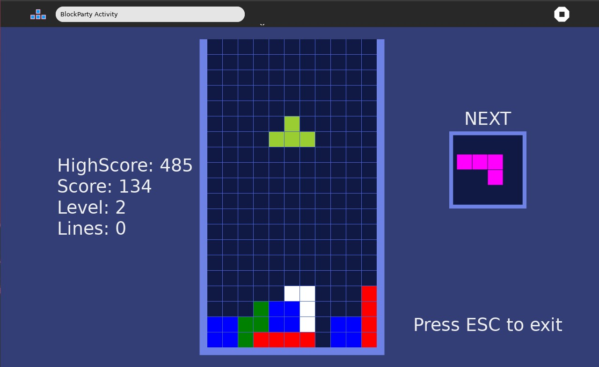

# Block Party Activity #

A very fun Tetris-like game!

Use left and right arrow keys to move blocks sideways.

Use up arrow key to rotate block.

Use space key to hard drop block.

Hold down arrow key to speed up the block.

How to use?
-----------

Block Party is not part of the Sugar desktop, but can be added.  Please refer to;

* [How to Get Sugar on sugarlabs.org](https://sugarlabs.org/),
* [How to use Sugar](https://help.sugarlabs.org/),
* [Download Block Party Activity](https://activities.sugarlabs.org/en-US/sugar/addon/4232).

Reporting Bugs
--------------

Bugs can be reported in the
[issues tab](https://github.com/sugarlabs/block-party-activity/issues)
of this repository.

Contributing
------------

Please consider [contributing](https://github.com/sugarlabs/sugar-docs/blob/master/src/contributing.md) to the project with your ideas and your code.

Author
------

Written by [Vadim Gerasimov](https://en.wikipedia.org/wiki/Vadim_Gerasimov), who ported the original Tetris game from Electronika 60 to IBM PC.

License
-------

The BlockParty Sugar Activity is licensed under MIT License. 
